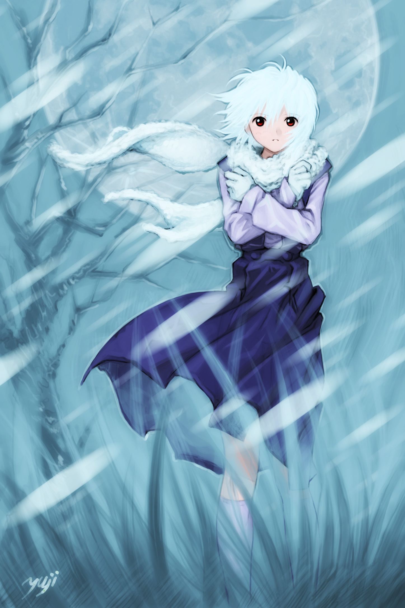

Characters
========
Protag
--------
* Guy, skilled swordsman, adventurer-ish, possibly a soldier of some sort
* Alleigance to Church, believes in and desires to champion their cause

Shade
--------
* A girl spirit/demon whose existence radiates bitter cold
* Brings death and suffering
* outer appearance grey, blue, faded, blood red staring eyes, "mind reader"
* quiet, blunt, sharp, non-emotive, bitter world view but oblivious to bitterness -> Rei-like
* Blood is deep red, brings warmth and healing
Image:

The Daugher
--------
* Priestess/Prophet-ish person for the Church, only one Daugher in the church
* Blind, but usually seen with an assuring smile
* Graceful, mannered, ladylike
* Thinking a little simple and straightforward from a sheltered life, but also tends to be unexpectedly insightful and sensitive to deeper ideas
* Naturally, fully subscribed to, even personifying, the Church's brand of faith
* Can give her a real name, only revealed late in her route

Thea
-------
* A quiet, sharp, independant girl, skilled in fighting and in all kinds of miscellaneous, street-survival skills
* Tends to be on the cold/calculative side
* Lost parents early - in particular mother to cold caused by Shade, has been living herself since
* Member of Order of Vengeance, but - like most members of the order - isn't blindly vengeful, constantly - sharply - rational

Organizations
========
The Church
--------
* Clerical order of a generally benevolent religion
* Has a de-facto political hold over the towns in the game, where the church resolves disputes and makes high-level decisions
* Focus of religion is on the appreciation of the value of all things, and manifesting that appreciation as love/kindness
* Divine entity worshipped by the Church is known as the Mother
* There is a human Daughter, that serves as a sort of prophet/high-priestess to the Mother

The Order of Vengeance
-------
* Has its origin as an elite thieves guild of sorts
* Accepts people deemed worthy who have no where else to go/belong to
* Members are loners, trained into skilled fighters/thieves/spies/assasins/explorers
* Now funded by Church sponsorship, accepts tasks from the church, effectively functioning as the Church's martial arm
* Do not consider themselves part of the Church, just in present agreement with the Church's goals

Places
========

Town1 (fancy name pending)
--------
* Where protag lives
* Fairly big and important place, stone dwellings, narrow streets, tall buildings, think Gondor-ish but maybe a little less grand
* Houses the main Church building in the center of the town, complete with tower, chapels, halls, the like
* the Daugher lives in the main Church building

Town2 (fancy name pending)
--------
* a satellite town of sorts of Town1, some distance away
* wider spaces, villages, farms, town square, taverns
* houses the HQ of the Order of Vengeance
* where Thea lives

Wilderness
--------
* Somewhere outside Town1
* Frozen woods, ringed around a frozen lake
* Quiet, dark, bitterly cold, except at the clearing around lake
* First encounter with Shade

Mount1 (fancy name pending)
-------
* Somewhere outside Town2
* Treacherous rocky terrain, large glaciers, strong winds, blizzards
* Final stage

Story Flow Outline
========
* Opens with protag in a snow-shrouded town1
* Called into Church, existence of Shade explained, protag volunteers to slay Shade
* protag sets out, searches for days, supplies run out, no resupply source (everything is dead)
* encounters Shade at moment of greatest weakness, in Wilderness
* powerless to fight Shade, interacts with Shade, gains reservations about slaying Shade
* returns to town1, night scene in Church chapel where protag seeks to sort out his thoughts and doubts as he prays to the Mother
* encounter and conversation with Daughter, some choice points
* awake next morning to sunshine, discover Shade has left the vicinity of town1, however so long as the Shade exists, it is bringing suffering and death somewhere
* protag pursues Shade to town2, possibly accompanied by the Daughter depending on previous choice points
* possibly encounters Thea in town 2, depending on previous choice points. Encounter will trigger more detailed exploration of town2 with Thea
* Track Shade to mount1
* After some more deliberation, set out for mount 1 with grim purpose, either with Daughter, or Thea, or alone based on choice points
* final encounter/confrontation with Shade
* Shade is slain, one way or another, leaving protagonist to ruminate on the implications and the future over the splotch of bright red upon the white snow, now glistening with the new sunshine